```{r setup, include=FALSE}
options(htmltools.dir.version = FALSE)
library(tidyverse)
theme_set(theme_minimal())
csw_palette <- c('#523634', '#301b28', '#ddc5a2', '#b6542c')

```


class: center
background-position: 50% 80%
background-image: url(images/squares_sharps.svg)
# What do Polygons have to do with sports betting?

**Sharps**: Sophisticated professional sports bettors. Sharps are long term winners. 
**Squares**: Bettors that apply no systematic approach to wagering, relying on gut instincts, silly trends, and the opinions of others.

Sharps and Squares exist on a spectrum, there's "sharp squares" and "square sharps."

---
class: inverse, middle

### Who Am I?

- Worked for an offshore sportsbook from 2004-2017
- Currently work for a political consultant

---

### What's this talk not about?

- Casino
- Horse Racing
- Poker
- DFS
- E-sports

--

### What's this talk about?

- How sportsbooks' earn money off squares.
- How sharps beat books.

---
class: center, inverse

.pull-left[


> "You can know the name of that bird in all the languages of the world, but when you're finished, you'll know absolutely nothing whatever about the bird. You'll only know about humans in different places, and what they call the bird. … I learned very early the difference between knowing the name of something and knowing something."

\- Richard Feynman

]

.pull-right[


> "..., it's my belief that many complex subjects invite semi-dummies. Obviously, "dummies" is an exaggeration. But many endeavors are so complex that just understanding all the "rules" makes a person look smarter than he is. Economics, derivatives trading, medical research, football coaching, and conducting wars are all good examples."

\- David Sklansky

]

### Information is Valuable

- Sharps don't share.
- Once information is in the public domain it has little to no value.
- Models and +EV plays come and go. Being sharp is how you think about problems.

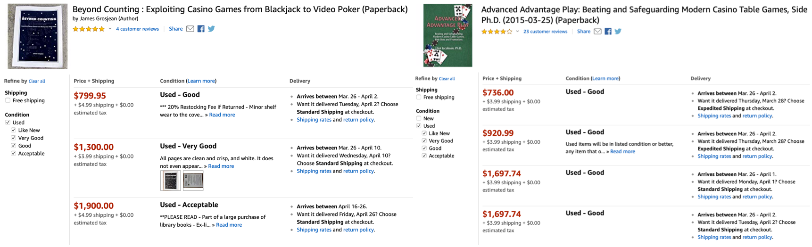

---

### What's a Sportsbook?

- A place where you can place wagers on sporting events. Nevada, up till recently, was the only state with legal walk-in sportsbooks.

- Most bettors in the US play at offshore sportsbooks that operate in the "gray" area.

--

- Two types of sportsbooks
  1. Credit books
  1. Post-Up books

--

+ People bet a lot more on credit. An 25 dollar average post-up bettor usually bets between 100 to 150 on average on credit.

- All legal sports betting operations are post-up.

---
class: center, bottom, inverse

### What's it like Working at a Sportsbook?

.pull-left[

When I tell people I worked at a sportsbook they usually think of this.

]

.pull-right[

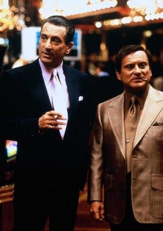

]

---

### This is the reality


---

### Sportsbooks are like Every Other Internet Business

Sportsbooks deal with most of the same standard data science problems most e-commerce businesses face.

--

- Dealing with customer churn.

--

- Optimizing customer signups via A/B testing.

--

- Forecasting the number of players for the following year for marketing and budgetary decisions.


--

- Preventing fraud. Usually credit card, but preventing bonus abuse is important too.

--

- Detecting web access anomalies, usually to prevent "bot" access.

--

But that's not why you're here.

---
### Can You Make Money Betting Sports

- Short Answer: Yes
- How? Easy, just make +EV bets.
- How do I find +EV bets? That's hard.

The difference between being a loser and printing dollars is razor thin. 

--

### How Profitable is Sports Betting?

#### A quick case study.

We create four simulated "bettors'." The only difference between each simulation is the winning percentage

- All bets at standard **-110**
- The four win rates are `0.5, 0.53, 0.55, 0.6`
- Starting bankroll: 10,000
- Number of bets: 1,000
- Number of simulations per win percent: 100
- Bet size: 2% of bankroll (should use Kelly but KISS)
---
class: center
### Bettor Simulation
```{r fig.retina=2, echo=FALSE, out.height=525, out.width=525}
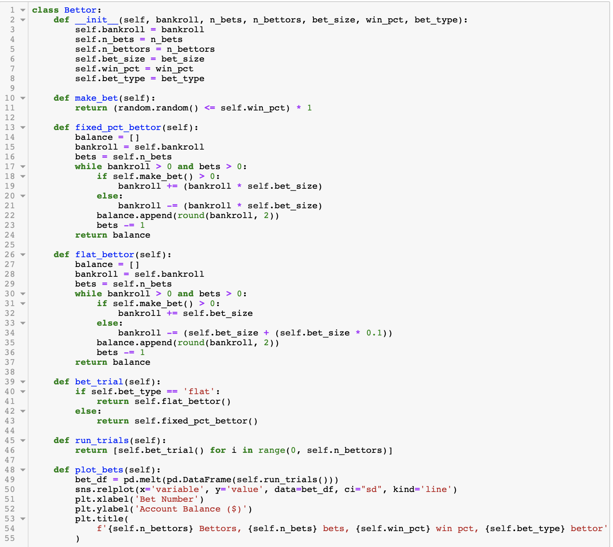
```

---
### Results


```{r fig.retina=2, echo=FALSE, fig.align='center', out.height='10%', out.width='60%'}
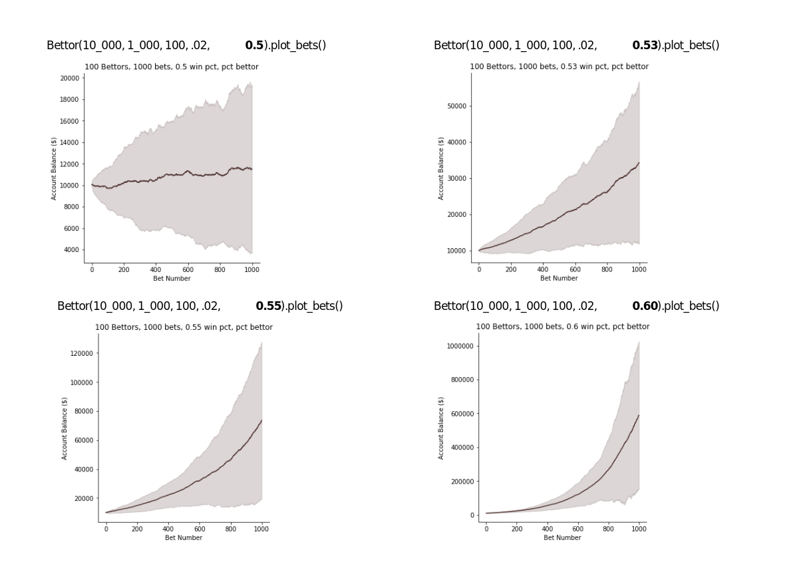
```


 
---
### Simulation Takeaways

- The difference between being a loser and winning millions is picking one more game correct than chance out of ten selections.

- Break-even at **-110** is 52.4% hitting 53% is still enough to earn a decent living.

- The higher your winning percentage the less uncertainty about your long term earnings.

- If you're hitting 55%+ of your bets your biggest problem is going to be finding places that will take your action.

 
---
### Isn't 1000 bets a lot?

There can't be 1000 good bets in a year? Let's do some simple math. How many bets on US sports are possible per year?

--

|League|Teams|Regular Season Games|Possible Bets
| --- |--- | --- | --- 
|MLB | 30 | 162 | 29160
|NBA | 30 | 82 | 22140
|NFL | 32 | 16 | 4608
|NHL | 31 | 82 | 15252
|FBS | 130|12 | 9360
|NCAA BB | 351 |30| 63180

A total of **143,700** possible bets.

--

- Odds provider Betradar advertises it offers 220K events per year. 

- Doesn't include, futures, props, live betting. Or, other sports like WNBA, European soccer, tennis, NASCAR, golf, etc.

---

### How do Sportsbooks Make Money?


#### Sportsbooks Don't Take Sides

- Despite what you might have read in "Freakonomics," books' don't have opinions.

--

- Books make money by taking a commission <sup>1</sup> from losing players' when they place a bet. 

--

- For the standard point spread bet most people think of the commission is usually 10% of the amount of the bet. It's common to see the odds listed as **-110**. This means you need to risk for 110 dollars to win 100.


--

- Two models for business. Take all the square action you can and ruthlessly kick out the sharps. Or, take sharp action and make money on the massive volume of bets. Over 95% of the books follow model one.

.footnote[
[1] This commission goes by many names. Juice, vig, vigorish, cut, take, etc.
]


---
class: top

### A Simplified Model


- Dolphins are playing the Patriots. The Patriots are a 6.5 point favorite. 
  - I want to bet the Dolphins +6.5 
  - You the Patriots -6.5.

--

- We both place bets for 100 with the sportsbook. Juice is standard **-110**

--

- Patriots win 28-7. 
  - Patriots cover (28 - 6.5) > Dolphins score (7) . 
  - Dolphins don't cover (7 + 6.5) < Patriots score (28)
  
--

#### Bet Results

|Period |Me | You |Book
| - - - | - - - | - - - | - - -
|Before Bet|110 | 110 |0
|During Bet|0|0|220
|After Bet |0 | 210 |10

---
### A Simplified Model cont.

- Standard model: sportsbook keeps 10 and payouts 210 for 220 put at risk. `10/210 =.0476`. On bets at **-110** odds the sportsbook expects to earn around 4.5%

--

- Another way to calculate the book expectation: Calculate the break-even percentage <sub>1</sub>for both sides of the wager. In this case both sides are **-110**, add the percentage for both and subtract 1.
  - `110/(100+100) = .5238`
  - `.5238 + .5238 = 1.0476`
  - `1.0476 - 1 = 0.0476`

--

In theory if both sides of the bet have an equal chance of winning (what -110 on both sides implies) then the combined probability of either side winning *should* add up to 1. The amount over 1 is approx the book's expected earnings. If you find a bet that adds up to under 1, bet, it means the bet is +EV.
  
  
.footnote[

[1] More on break-even percentages later.

]

---

# Model vs Real-world

- Books unlikely to get balanced action.
- 4% return isn't bad money but the book has costs. Getting stiffed (credit), marketing, infrastructure, staff (post-up).

### How to earn more money?

--

**Give players more to bet on!**

The more bets a player makes the more likely he is to lose in the long run.

- Offer more bet types. 
- Offer different types of bets with a higher edge for the book.
- Offer more events to bet on.

---

### Most Common Forms of Betting (in US)

For any game these three markets are the most common forms of betting.

- Money line: Who is going to win the game.
- Spread: What "handicap" (points, runs, goals, etc) makes the match equal when you adjust the score by the spread<sub>1</sub><sub>2</sub>.
- Total: Over or under the combined score of the two teams playing.

For each of these it's possible to split into periods, first half, second half, first quarter, etc.


.footnote[
[1] Invented by Charles K. McNeil, a math teacher and bookmaker from Chicago, in the 1940s.

[2] In the UK spread betting is a wager that pays out based on the difference from the line. In the the US this form of wagering is called 'Action points.' 

]
---

### Different Bet Types

.pull-left[

### Parlays

- Parlays combine multiple "straight" bets into one for an increased payout. players need to win all bets to win.
- Spreads/Totals parlay payouts are fixed. Vary between books. ML's payout at 'true' odds.
- Probability of 3-team parlay 12.5%, that's +700 odds.  Most books', pay +600 on 3-teamer earning a theoretical 12.5% on each 3-teamer.
- Parlays can be manipulated by sharps i.e. correlated parlays, bonus abuse

]

.pull-right[

### Teasers

- Teasers, like parlays, combine multiple plays but let the bettor move the point spread or total by a set number of points.
- Teasers are basketball and football only.
- Teaser payouts vary book to book.
- Standard NFL 2-team teaser is **-120**. EV = **-14.52%**.
- Played correctly teasers are +EV and a common sharp play. Books' are constantly defending against them.

]

---

# Less Popular Bets

These bets are usually much more lucrative for the book.

.pull-left[

### Futures (Long Bets)

- Dolphins win over/under 8.5 regular season games (NFL)
- team to win Eastern Conference Finals (Best of 7) (NBA)
- team wins Western Conference Finals in `n` games. (NBA)
- team to win 3 game series (MLB)
- player to win first round (PGA)

]

.pull-right[
### Props

- Brady over/under 23.5 receptions (NFL)
- First score over/under 7.5 minutes (NFL)
- First team to `X` points (NFL)
- Score / No Score first inning (MLB)
- Max Scherzer O/U 7 strikeouts (MLB)

]
---

# Live Betting (the future)

.pull-left[

Every possible bet type at any point in the game.

- Spreads, ML's, totals
- Juice is usually higher
- Lines change fast
- Examples of common bets offered beyond the main three types
  - Race to *n* points
  - Either team scores *n* points
  - Margin of victory
  - Alternate spreads / totals
  - Player props
  
]


.pull-right[
  
  ### Live Betting Exploits
  
  - For sharp bettors' live betting is a lucrative new area.
  - Low limits is common defense against sharps.
  - Lot's of opportunity for fraud: TV feeds faster than sportsbooks, watching game in-person, AM radio.
  - Models are much simpler than you'd think.
  - Baseball in-game is probably the sharpest lines.
  - More options and weaker leagues still offer new opportunities.
  
]

---
class: center

### Managing Risk - Methods the Books Use

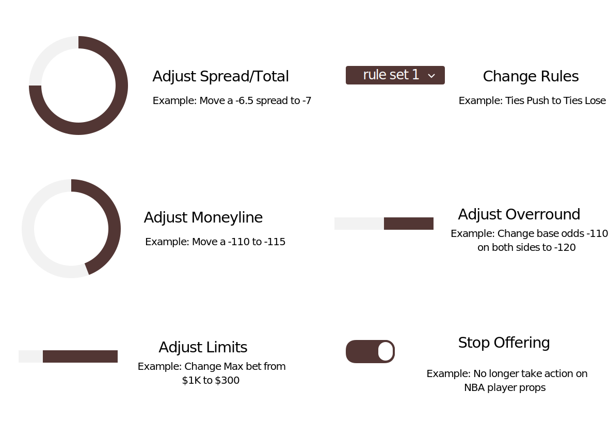

---

# What moves the line

- **Sharp Books**

For US facing books' Pinnacle and Bookmaker.eu are the most important books.

--

- **Sharp Bettors'**

A 500 bet from a pro can move the line more than a 20k bet from a square.

--

- **Money**

Eventually if the money is skewed enough you need to move the line, even if the action is 100% square.

---
class: center
### Betting Limits

It's about trade-offs.

--

Small markets are easy to beat but you can't bet a lot on them.

--

Opening lines are easier to beat than closing lines but limits are low.

--

Derivatives are much more beatable compared to game lines but lower limits.

--

```{r out.width=475, out.height=355 , echo=FALSE}
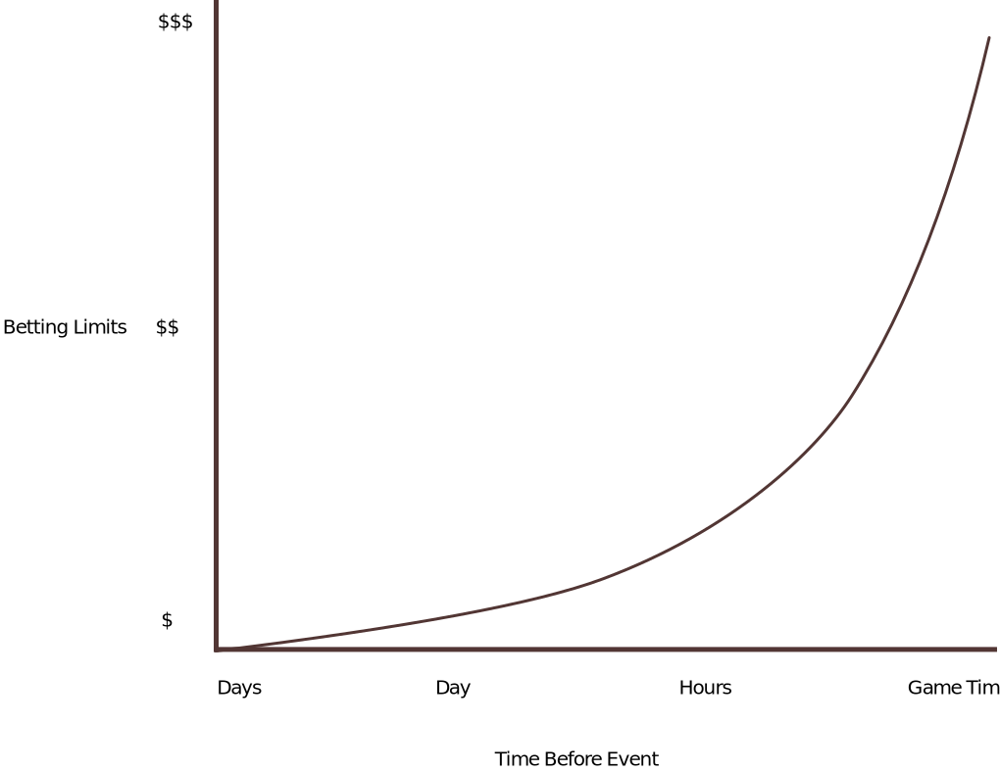
```

---
class: center, middle, inverse
### What's an overround?

> The over-round (Vigorish, or simply "vig", or "juice") is what gives the bookmaker his profit. If the over-round is 1.2 (sometimes written as 120%) the bookmaker will expect to pay out 100 dollars for every 120 dollars he takes in, yielding him an expected profit of 20/120 = 16.7%.<sub>1</sub>


.footnote[

This is an altered example from http://www.bettingmarket.com/overround.htm

]
---
### How books select overround/juice

- Common conventions that most book follow. 
- Prices vary in smaller markets and with exotic bet types. 
- Recreational books charge as much juice as they can get away with. 
- Squares can't do the math to figure out the juice they're paying but much like high rake, they notice they're losing faster.

---

### *x* cent lines

- Charging 110 on both sides of point spread bet is referred to as a **20 cent line**. 
- **30 cent line** charges 115 on both sides of a spread bet.
  - Some derivatives like team totals charge 30 cent line.
- **40 cent line** charges 120 on both sides.
- Baseball is commonly a **10 cent line** up to -190
- NBA and NFL money-lines are usually **20 cents**
- **x cent lines** aren't stationary around 100. A common boxing money-line might be **-200/160**
- Cent lines used to be rounded to increments 5, i.e. 105,110,115,120
--

50% win probability on both sides of an event translate to the following overrounds.

|Cent Line | Format | Overround
| --- | --- | ---
| 10 | -105 | 1.024 
| 20 | -110 | 1.047
| 30 | -115 | 1.069
| 40 | -120 | 1.090

---
### The problem with fixed cent lines

Most squares don't realize that they have a big edge with fixed cent lines.

An example,

- Game A: **-105/-105** 
- Game B: **-180/170** 

Both are **ten cent lines**. But even if both lines are solid the player is paying much less juice. **Decimal lines don't have this problem.**

This is bad for the book but good for the player. Most old-time US bookmakers can't wrap their head around this fact.

|Game|Odds | BreakevenPct | Overround|JuicePaid<sub>1</sub>
| --- |--- |--- | ---
|A |-105/-105|51.21%/51.21%|1.0242|2.7%
|B |-180/170| 64.26%/37.03%|1.0129|1.2%

.footnote[
[1] To calculate the true juice paid 1-(1/overround)

]

---
class: center
### Juice on 'Dime' line

```{r echo=FALSE, message=FALSE, warning=FALSE, dpi=200, dev='svg',out.height=500, out.width=500}

create_odds_chart <- function(s,e,juice){
  v_num <- seq(s,e,-1)
  data.frame(line = v_num,
             comeback = (v_num + juice)*-1)
}

ml_to_p <- function(moneyLine) {
  # convert money lines entered as hundreds i.e 150, -120
  # to 1.5, -1.2
  moneyLine <-
    ifelse((moneyLine <= -100 |
              moneyLine >= 100), moneyLine / 100, moneyLine)
  # convert money to probability
  ifelse(moneyLine < 0,
         moneyLine / (moneyLine - 1),
         1 / (moneyLine + 1))
}


x <- data.frame(line = c(-105, -106, -107,-108,-109), 
           comeback = c(-105, -104, -103, -102,-101))


dime_line <- create_odds_chart(-110,-190,10)
dime_line <- bind_rows(x, dime_line)
# dime_line

dime_line %>% 
  mutate(hold = 1-(1/(ml_to_p(line) + ml_to_p(comeback)))) %>% 
  filter(line >= -190) %>% 
  ggplot(., aes(desc(line), hold)) +
    geom_line(col='#301b28') +
    scale_x_continuous(breaks = seq(105,190,10),
                       labels = seq(-105,-190,-10)) +
    scale_y_continuous(labels = scales::percent_format()) +
  labs(x = "Money Line", 
       y = "Juice Paid")
```
---

### Tools - Don Best

**Dirty Secret** 95% of sportsbooks' don't set their own lines.

Until XML/Json technology popular many books paid "odds makers" to follow other books' (usually Pinnacle or Cris) line movements.

Eventually DonBest started offering odds feeds as XML from other books' and books pegged their line to the book of choice.

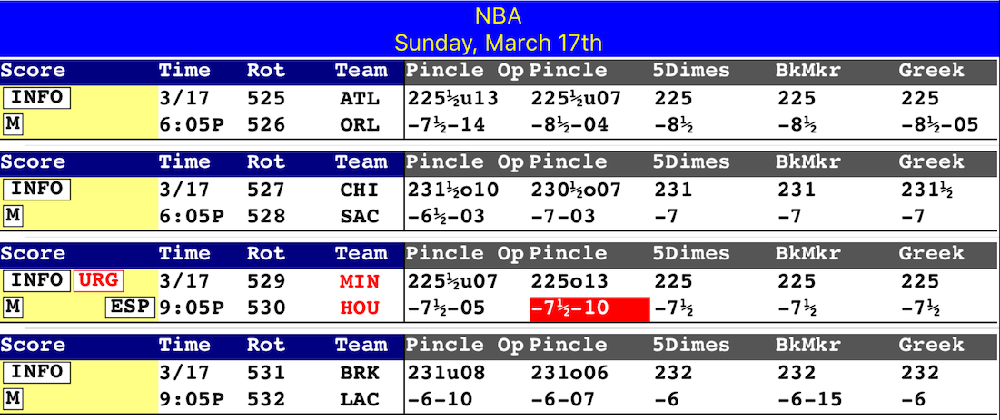

---

### Tools - Betradar

.pull-left[

- Started as a soccer/European sport solution but much more sophisticated than DonBest (eventually bought Don Best). 

- Official betting partners of the NBA. Lobbying for "official" data only sportsbooks.

- Add your juice/margin into their models or copy odds from over 300 books.

]

.pull-right[

]


---
class: inverse, center, middle

### Let's Talk About Betting

---
class: inverse

### Types of Winning Players

1. The Sharps
  - Handicappers
  - Modelers
  - Movers

--

1. The Advantage Players (Quants)
  - Probability players
  - Promo exploits
  - Bonus Hunting
  
--

1. Line Hunters
  - Scalpers (arbitrage)
  - 'Hunt and peck' off lines
  - Steam Chasers


---
class: inverse, center, middle

### Betting Math

---

### The Foundation

.pull-left[

#### Probability to Money Line

```{r}
p_to_ml <- function(.p) {
  ifelse(.p > .5,
         .p / (1 - .p) * -1,
         (1 - .p) / .p)
}

p_to_ml(.75)
```


#### US Odds to Decimal

```{r}
us_dec <- function(.ml) {
  ifelse(.ml < 100, 
         1 - (100 / .ml), 
         1 + (.ml / 100))
}

us_dec(-110)
```


]

.pull-right[

#### Money-line to Probability

```{r}
ml_to_p <- function(.ml) {
  ifelse(.ml < 0,
         .ml / (.ml - 1),
         1 / (.ml + 1))
}

ml_to_p(1.8)
```


#### Decimal Odds to US

```{r}
dec_us <- function(.d) {
  ifelse(.d >= 2, 
         100 * (.d - 1),
         -100 / (.d - 1))
}

dec_us(2.7)
```

]

---
### Calculating EV

- Multiple the probability of an event happening by the amount won/lost associated with the result. Sum the outcomes.

#### Simple 2-Way EV

We flip a fair coin, heads I pay you 1.05, tails you pay me one dollar. 

```{r}
p_heads <- .5
p_tails <- 1 - p_heads
amt_heads <- 1.05
amt_tails <- -1
ev <- (p_heads * amt_heads) + (p_tails * amt_tails)
paste("Your EV is ", ev, "per flip." )
```

---


#### Simple (but more complicated) Multi-way EV

- Dolphins are playing the Bucs. Game opens Miami -4. You bet the Bucs +4 **110/100**
- An injury is reported and the line moves to Miami -2. You bet Miami -2 **110/100** 

Is this a bad play? What's the EV? We need to know the push frequencies of 2, 3, and 4 points. 

```{r}
push <- c("2" = .02, "3" = .10, "4" = .03) # conquering risk
one_side <- (1 - sum(push))
rest <- (100 - 110) # win one, lose one
fins_2 <- 100 # Bucs +4 win , # Fins -2 push
fins_3 <- 100 + 100 # Bucs +4 win, # Fins -2 win
fins_4 <- 100 # Bucs +4 push, # Fins -2 win

ev <- (one_side * rest) + (fins_2 * push['2']) + (fins_3 * push['3']) + (fins_4 * push['4'])

a <- paste('We make', round(ev), 'on our 220 put at risk.')
b <- paste("That's a",scales::percent(round(ev)/220), "ROR")
paste(a,b)
```


---
### Break-even Rate

```{r}
breakeven_rate_ml <- function(.ml) {
  ifelse(.ml < 0,
         abs(.ml) / (abs(.ml) + 100),
         100 / (.ml + 100))
}

common_lines <- c(seq(-110,-160,-10),seq(100,150,10))

breakeven_rate_ml(common_lines) %>% round(3)
```

---

### Break-even Rate with Multi Event Plays

Why are two team parlays at **+260** a bad bet?

```{r}
breakeven_wgr_amt <- function(.amt_risk, .amt_won, .event=1){
  # if event > 1 the return value represents the
  # percentage of time each leg must win
  (.amt_risk / (.amt_risk + .amt_won))^(1/.event)
}

paste(
  "In a 2-team parlay each leg must hit approx", 
  scales::percent(breakeven_wgr_amt(100, 260, 2)),
  " of the time."
)

```

+ The break-even rate for a straight bet at **-110** is `r scales::percent(breakeven_wgr_amt(110,100))`. 

---
### Decoding Juice

#### Calculate Overround

```{r}
overround <- function(juiced_line) {
  sum(ml_to_p(juiced_line))
}

fair_line_conversion <- function(juiced_line) {
  p_to_ml(ml_to_p(juiced_line) / sum(ml_to_p(juiced_line)))
}

paste('Overround on -110 odds= ', overround(c(-1.1, -1.1) %>% round(.,2)))

fair_line_conversion(c(-1.55,1.45))
```

---
# Political Example

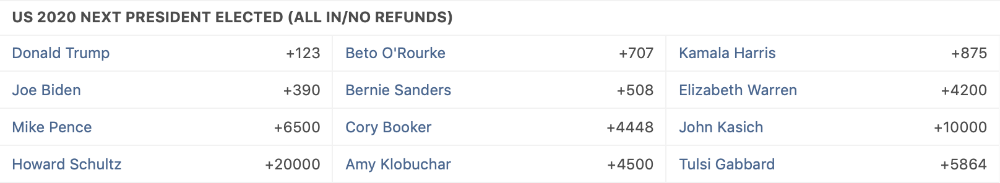

- What's the book making on this wager?
- What's the true odds?

---
### Political Example cont.

```{r}
pres_odds <-
  c(1.23, 7.07, 8.75,
    3.90, 5.08, 42.00,
    65.00, 44.48, 100.00,
    200.00, 45.00, 58.64)

cands <- c('Trump','ORouke','Harris',
           'Biden','Sanders','Warren',
           'Pence','Booker','Kasich',
           'Schultz','Klobuchar','Gabbard')

df <- tibble(
  cand = cands,
  odds = pres_odds,
  fair_odds = round(fair_line_conversion(pres_odds),3),
  pct = ml_to_p(fair_odds) %>% scales::percent()
)

paste('The overround is:', overround(df$odds))
```


---

### Political Example cont.

```{r echo=FALSE}
arrange(df, fair_odds) %>% 
  knitr::kable(format = 'html')
```


---
### Add Juice to Fair lines

#### Pricing the MLB AL East Division Winner.

Estimate each team's probability of winning the division. The probabilities need to add up to 1.

- Yankees 46%
- Redsox 35%
- Rays 9%
- Blue Jays 6%
- Orioles 4%

--

There's a lot of uncertainty in the estimates. Because of this, our overround should be much higher than an standard game. 

---

### Add Juice to Fair Lines cont.

```{r}
add_juice <- function(fair_ml, juice) {
  p_to_ml(ml_to_p(fair_ml) * juice)
}

teams <- c('NYY', 'BOS', 'TBB', 'TOR', 'BAL')
p_est <- c(.46, .35, .09, .06, .04)
fair_line <- p_to_ml(p_est)
juiced <- add_juice(fair_line, 1.2) %>% round(., 2)

knitr::kable(tibble(teams, p_est, fair=round(fair_line,2), juiced), format = 'html')
```

---
### What's Your Winning Percentage?

Commonly you'll hear bettors say:

> I'm hitting 58% of my bets

But without complete information, that number is meaningless.

--

#### Example

What's your winning percentage?


|Risk  |ToWin |Result
|----  |----  |-----
|-150  |100   |W (100)
|100   |160   |W (160)
|-250  |100   |L (-250)

Square says:

> 66%

---

### Normalized Win Percentage

```{r}

results <- c(100,160,-250)

win_pct_normed <- function(results){
  win <- results[results > 0]
  loss <- results[results < 0]
  sum(win) / (sum(win) + sum(loss)/-1)
}

# True Win Percentage
win_pct_normed(results) %>% 
  round(.,3) %>% 
  print()
```

---
class: inverse, center, middle

### Using Models

---
class: inverse, center, middle

.pull-left[

]

.pull-right[

> With four parameters I can fit an elephant, and with five I can make him wiggle his trunk.

\- John von Neumann

]

---

### The Modeling Process

**Remember sports analytics != sports betting.**

1. Get a database for your sport of choice. You'll need past lines and scores and stats.
1. Find meaningful variables (simple is always better)
1. Feature engineer if needed
1. Compare your results to past lines an analyze error.

Finding the right metric to test your model against is tricky. In the end you're looking for your estimated spread to be closer to the mov than the closing spread.

*note*: Chucking scores and stats into a machine learning model isn't enough to win.

---

### What Are We Predicting

- Normally we're predicting game outcomes. This can either be margin of victory or the likelihood of team A beating team B.
  - You can use either regression or classification algorithms. If you use a classification model it's possible to turn the percentage into a point spread using a conversion table.
- Less common but still valulable is predicting the direction a line will move. There's +EV plays if you can bet both sides if the line crosses key numbers.

---
### Example Model

``````{r fig.retina=2, echo=FALSE, out.height=525, out.width=525}
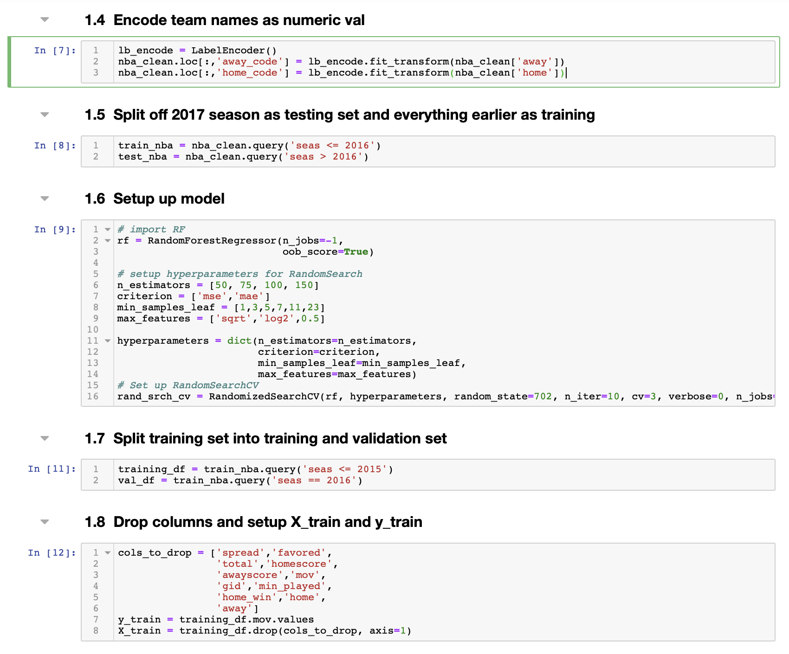

```

---

### Example Model cont.

``````{r fig.retina=2, echo=FALSE, out.height=525, out.width=525}
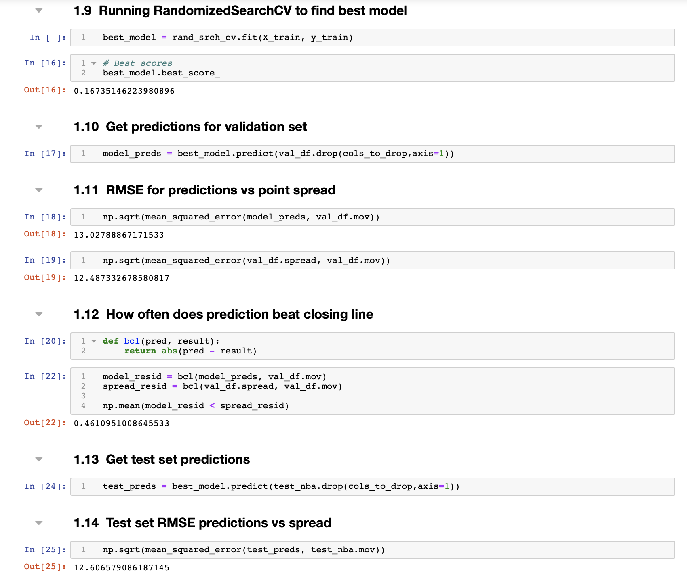

```


---
class: inverse, center, middle

### Case Study: NCAA Basketball Example

---
### Gather Data

Lot's of solid options for NCAA data. Don't reinvent the wheel. Find someone whose done the work.

- [Luke Benz's Repos on github contain a wealth of information](https://github.com/lbenz730/NCAA_Hoops)

- [The prediction tracker gives you historical closing lines for the past 14 seasons](http://www.thepredictiontracker.com/basketball.php)

```{r eval=FALSE,cache=TRUE}
ncaa_results_1819 <- 'https://raw.githubusercontent.com/lbenz730/NCAA_Hoops/master/3.0_Files/Results/2018-19/2019_Final.csv'

results <- read_csv(ncaa_results_1819,guess_max = 5000)
```

---
### Rating System

Rating systems are a deep subject themselves. The most famous is probably the models behind the old BCS selection system and RPI used for NCAA basketball.

- The Massey, Colley, and ELO (538) models are the best known ranking systems. Public rating/ranking systems won't beat the spread long term. Check out the [comperank](https://github.com/echasnovski/comperank) package for implementations of these and other models.

```{r eval=FALSE}
# simplfy our dataframe
df <- results %>%
  select(gid = game_id,
         team,
         opp = opponent,
         location,
         team_score,
         opp_score) %>% 
  filter(!is.na(team_score))
```

---

### Rating System cont.

Some utility functions.

```{r}
# initialize power ratings
clear_ratings <- function(){
  df %>%
    group_by(team) %>%
    summarise(power = 0) %>%
    ungroup()
}

add_hfa <- function(df){
  df %>% 
    mutate(opp_score = case_when(
      location == 'H' ~ opp_score + 4,
      location == 'V' ~ opp_score - 4,
      TRUE ~ opp_score
    ))
}
```


---
### Rating System cont.

Calculate the team's rating by summing the margin of victory, plus the opponent's power rating, and dividing by the number of games played. 

```{r}
get_power_ratings <- function(.df, .ratings) {
  .df %>%
    left_join(.ratings, by = c('opp' = 'team')) %>%
   {{ mutate(margin = team_score - opp_score + power)}} %>%
    group_by(team) %>%
    {{summarise(power = sum(margin) / n())}} %>%
    ungroup()
}
```

This model is iterative, each pass through the data uses an updated power rating. This approach does away with the need for strength of schedule.

---

### Rating System cont. 

#### Run Model

```{r eval=FALSE}
tm_ratings <- clear_ratings() # init each team rating to 0
df <- add_hfa(df) # add HFA
n_trials <- 50 # number of iterations to go through
ratings_list <- vector("list", length = n_trials) # good R practice

# For loops aren't great in R but this is small data
# Easy to understand

for (i in 1:n_trials){
  tm_ratings <- get_power_ratings(df, tm_ratings)
  ratings_list[[i]] <- tm_ratings
}
```

---
class: center
### View Results

`arrange(tm_ratings, desc(power)) %>% head(10)`

|team           |    power|
|:--------------|--------:|
|Gonzaga        | 26.71077|
|Duke           | 25.74658|
|Virginia       | 24.37975|
|Michigan St.   | 23.36485|
|North Carolina | 23.13977|
|Tennessee      | 20.44052|
|Michigan       | 20.43373|
|Purdue         | 19.42287|
|Kentucky       | 19.22065|
|Texas Tech     | 18.99942|

---

### Ratings Converge Quickly

```{r out.width=800, out.height=500 , echo=FALSE, fig.retina=3}
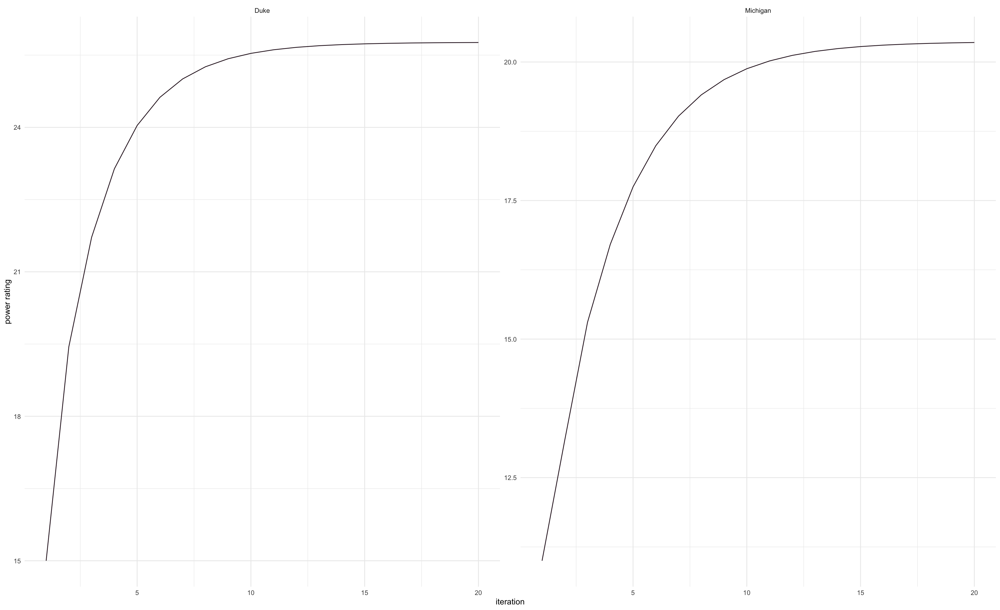
```

---

### Compare with Popular Rating Systems

Using the `comperank` package

#### Prepare the Data

Results must be in a specific format.

```{r message=FALSE, warning=FALSE, cache=TRUE}
library(comperank)
ncaa_results_1819 <- 'https://raw.githubusercontent.com/lbenz730/NCAA_Hoops/master/3.0_Files/Results/2018-19/2019_Final.csv'
results <- read_csv(ncaa_results_1819,guess_max = 5000)
ncaa19 <-
  dplyr::filter(results, location == 'H') %>%
  select(
    player1 = team,
    score1 = team_score,
    player2 = opponent,
    score2 = opp_score
  ) %>% 
  na.omit() %>% 
  comperes::as_widecr()
```


---
### Colley Method

```{r eval=require('comperank')}
colley <- rank_colley(ncaa19)
arrange(colley, ranking_colley) %>% 
  head(10) %>% 
  knitr::kable(format = 'html')
```

---

### Massey ratings


```{r eval=require('comperank')}
massey <- rank_massey(ncaa19)
arrange(massey, ranking_massey) %>% 
  head(10) %>% 
  knitr::kable(format = 'html')
```

---

### Markov ratings

```{r eval=require('comperank')}
markov <- rank_markov(ncaa19,
              !!!h2h_funs[c("num_wins","mean_score_diff_pos")],
              weights = c(0.4, 0.6))
arrange(markov, ranking_markov) %>% 
  head(10) %>% 
  knitr::kable(format = 'html')
```


---
class: inverse, center, middle

# Turn Ratings into Spreads

---
# Historical Point Spread Data

Using our ratings we can predict the average amount a home team will win a game by the simple formula `home edge + home team rating—away team rating`. In [Mathletics](https://www.amazon.com/Mathletics-Gamblers-Enthusiasts-Mathematics-Basketball/dp/0691154589), Wayne Winston cites a paper by Hal Stern.

> Stern showed that the probability that the final margin of victory for a home NFL team can be well approximated by a normal random variable margin with mean = home edge + home team rating—away team rating and a standard deviation of 13.86

First let's find the standard deviation

```{r message=FALSE, warning=FALSE}
pred_tracker_data <- 'http://www.thepredictiontracker.com/ncaabb17.csv'
ncaa_ps_17 <- read_csv(pred_tracker_data, guess_max = 5000) %>% 
  transmute(mov = hscore - rscore, 
            s_diff = mov - line)
sd(ncaa_ps_17$s_diff,na.rm=TRUE)
```

---

# Difference Between Spreads and Outcomes

Next let's confirm the normal assumption.

```{r message=FALSE, warning=FALSE, dpi=200,fig.height=3.5, fig.width=6, dev='svg'}
ggplot(ncaa_ps_17, aes(s_diff)) +
  geom_histogram(binwidth = 2, fill='#ddc5a2', color='white') 
```

---
### Simulate Game

We now have the knowledge needed to simulate a game.

We'll use two teams from the iterative ratings table.

1. Virginia - 24.37975 (1 seed)
2. Texas Tech - 18.99942 (3 seed)

A rough estimate of the spread is `24.37975 - 18.99942`, 5.4 which we'll round up to **5.5**. There's no home field in this match-up. We can use this spread to estimate the percentage of time Virginia wins the match-up.

```{r}
ncaa_sd <- 11
mu <- 5.5
sims <- qnorm(runif(1000), mu, ncaa_sd) # simulate 1000 games
paste('Pct of games home team wins', scales::percent(mean(sims > 0)))
paste('Median mov', median(sims) %>% round()) # should be spread
```

---
### Scale Up Predictions


```{r eval=FALSE}
matchups <- 
  expand.grid(team=tm_ratings$team,
              opp=tm_ratings$team) %>% 
  as_tibble() %>% 
  filter(team != opp) %>% 
  left_join(tm_ratings) %>%
  rename(tm_power = power) %>%
  left_join(tm_ratings, c('opp' = 'team')) %>%
  rename(opp_power = power)

simulate_game <- function(tm_pwr,
                          opp_pwr,
                          sd = 11,
                          trials = 1) {
  mu <- tm_pwr - opp_pwr
  qnorm(p = runif(trials),
        mean = mu,
        sd = sd)
}

```


---
### Scale Up Predictions cont.

```{r eval=FALSE}
sim_matchups <- map2(matchups$tm_power,
     matchups$opp_power,
     ~simulate_game(.x,.y,trials = 10000))

p_preds <- sim_matchups %>% 
  map_dbl(~mean(.x > 0))

matchups$pct_preds <- p_preds
```


---
class: inverse, center

### Case Study: NFL Calculating the Value of Points

---
### How Much is a ½ Point Worth?

The answer... it depends. Buying off what number? The question you need to answer is how often does my push turn into a win.

```{r echo=FALSE, message=FALSE, warning=FALSE, dpi=200,fig.height=4, fig.width=6, dev='svg'}
library(tidyverse)

seven_win <- 100
seven__loss <- -110
seven__push <- 0


scaled_win <- (100/120) * 110

sixhalf_win <- scaled_win
sixhalf__loss <- -110
sixhalf__push <- scaled_win

seven <- c(seven_win, seven__push, seven__loss)
sixhalf <- c(sixhalf_win, sixhalf__push, sixhalf__loss)


graph_ev <- function(w,l,p,amts){
  (amts[1] * w) + (amts[2] * p) + (amts[3] * l) 
}


wl_pct <- seq(.8,1,.005)
p_pct <- 1 - wl_pct
w_pct <- wl_pct / 2
l_pct <- wl_pct / 2

df <- tibble(
  w = w_pct,
  p = p_pct,
  l = l_pct,
  sixhalf_ev = graph_ev(w,l,p,sixhalf),
  seven_ev = graph_ev(w,l,p,seven),
  diff = (sixhalf_ev * -1) + seven_ev
)


df %>%
  select(p, sixhalf_ev, seven_ev) %>%
  gather(pts, ev, -p) %>%
  mutate(pts = ifelse(pts == 'sixhalf_ev', 6.5, 7) %>% as.factor()) %>%
  ggplot(aes(p, ev, col = pts)) +
  geom_line(size = 2) +
  labs(x = 'Push Percentage',
       y = 'EV of $110 Bet',
       col = 'Point Spread') +
  scale_x_continuous(labels = scales::percent_format(),
                     breaks = seq(0, .2, by = .02)) +
  scale_y_continuous(labels = scales::dollar_format()) + 
  scale_color_manual(values = c('#ddc5a2','#523634')) +
  theme_minimal()
  


```

---
### Push Charts

In betting the value of a half point (or run, goal, etc) is derived from push percentages.In [Weighing the Odds in Sportsbetting](https://www.amazon.com/Weighing-Odds-Sports-Betting-King/dp/0935926305) Yao explains the process of converting a push percentage into money line.

1. Subtract the push percentage from 100
1. Divide the result by two
1. Convert the result into a money-line
1. Subtract 100 from the result of step 3, this is value of the half point

---
### An example

Let's assume that the push percentage for a spread of seven in the NFL is `6.5%`. The value of buying a half point on or off a point spread of 7 points is calculated as follows.

1. `100 - 6.5 = 93.5`
1. `93.5/2 = 46.75`
1. Convert 46.75% to a money-line = `114`
1. `114 - 100 = 14`

So according to the example the fair price for buying on or off the seven in NFL is 14 cents.

If you can buy a half point or more for less than the value of the fair price it's +EV.

---
### Creating a Push Chart

In most sports the problem is not enough games for a decent sample size, how to get around this? One way is to widen the "window" of games looked at. It might not be the most efficient but it gets the job done.


```{r message=FALSE, warning=FALSE}
file_path <- file.path('~','Dropbox','ArmchairAnalysis','nfl_00-18')
nfl <- read_csv(paste0(file_path,'/','GAME.csv'))

grade_ats_home <- function(h_pts, v_pts, h_sprd) {
  case_when(h_pts + h_sprd > v_pts ~ 'ats_w',
            h_pts + h_sprd == v_pts ~ 'ats_p',
            TRUE ~ 'ats_l')
}
```


---

### Creating Push Chart cont

The push chart function

```{r}
push_chart <- function(df = nfl,
                       ps, # point spread
                       wnd = 2, # window
                       seas_cut = 2008) {
  # ps = point spread
  # wnd = window
  df %>%
    filter(seas >= seas_cut) %>%
    mutate(
      sprh = sprv * -1, # view home team fav as -7 instead of 7
      mov = ptsh - ptsv,
      ats_result = grade_ats_home(ptsh, ptsv, sprh)
    ) %>%
    filter(sprh >= ps - wnd & sprh <= ps + wnd) %>%
    mutate(push = (mov == (ps * -1)) * 1) %>%
    summarise(games = n(),
              push = sum(push))
}
```

---
### Creating Push Chart cont.
```{r}
spreads <- seq(-21, 14, 1)

pc_df <- bind_cols(tibble(spreads), 
                   map_df(spreads, 
                          ~push_chart(ps=.x, wnd=2)))

pc_df %>% 
  mutate(pct = round(push/games,3)) %>% 
  arrange(desc(games)) %>% 
  head(5) %>% 
  knitr::kable(format = 'html')
```

---

### Creating Push Chart cont.

Removing H/A perspective

```{r}
get_fair_price <- function(.pct){
  ml <- p_to_ml((1 - .pct) / 2)
  (ml - 1) * 100
}

prices <- pc_df %>%
  group_by(spread=abs(spreads)) %>%
  summarise(games = sum(games), push = sum(push), 
            pct = round(push/games,3)) %>% 
  arrange(desc(pct)) %>% 
  filter(games >= 100) %>% 
  mutate(fair_price = get_fair_price(pct) %>% round())
```

---
### Creating Push Chart cont.

Fair prices

```{r}
prices %>% 
  head(10) %>% 
  knitr::kable(format='html')
```

---

class: center, inverse, middle
### Case Study: EPL Correlated Wagers

---

## EPL Counts

```{r message=FALSE, warning=FALSE}
epl_17 <- read_csv('data/epl_1617.csv')
epl_18 <- read_csv('data/epl_1718.csv')

epl_17 %>% 
  count(draw = FTHG == FTAG) %>% 
  knitr::kable(format = 'html')
```

- Approx 22% of games in the EPL end in a draw (at least in 2017).
- Of the 84 games that ended in draw how many had a combined total goals of 2 or less

```{r}
epl_17 %>% 
  filter(FTHG == FTAG) %>% 
  count(FTHG, FTAG) %>% 
  filter(FTHG < 2) %>% 
  summarise(sum(n)) %>% 
  pull()
```

---
## EPL Counts cont.

- 65 out of the 84 draws had 2 goals or less scored (77%)
- If we parlayed the game being a draw to the game going under 2.5 goals we win our bet 77% of the time.

Calculate the median payouts for draw and under and the median parlay payout.

```{r}
calc_parlay_payout <- function(odds_1, odds_2){
  p_to_ml((1/odds_1) * (1/odds_2))
}

epl_17 %>% 
  select(PSCD,ou_odds=`BbAv<2.5`) %>% 
  mutate(payout = calc_parlay_payout(PSCD, ou_odds)) %>% 
  summarise(med_draw=median(PSCD),
            med_ou = median(ou_odds),
            med_odds = median(payout)) %>% 
  knitr::kable(format = 'html')
```

---
## EPL Counts cont.

Simple math to estimate our edge. Assume 1,000 matches.

```{r}
games <- 1000
pct_draw <- .22
pct_u_draw <- .77

draw_games <- games * pct_draw
winners <- floor(draw_games * pct_u_draw)
losers <- 1 - winners

est_win <- (((winners/games) * 600) - ((losers/games) * 100)) /100
paste('For every 100 wagered we expect a return of', est_win*100)
```

---

### Testing Theory 

- We'll blindly bet draw+under on every match
- We'll use a more conservative parlay payout of +600
- These matches are from the 2017/2018 season. We haven't calculated any stats from them yet.

```{r}
# 2018 results
count(epl_18, draw=FTHG == FTAG, under=FTHG + FTAG <= 2) %>% 
  knitr::kable(format = 'html')
```

---

### How Theory Performed

```{r}
winners <- 77
losers <- nrow(epl_18) - winners # 303 total
volume_bet <- nrow(epl_18) * 100 # the amount we risked
paste('We risk a total of ', scales::comma(volume_bet))
won <- ((77 * 600) - (losers * 100))
paste('We won ', scales::dollar(won))
paste('An ROR of', scales::percent(won/volume_bet))
```


---
class: center, inverse, middle
### Case Study: NBA Opening vs. Closing Lines

---

### Gather Data

```{r message=FALSE, warning=FALSE}
library(lubridate)
nba <- read_csv('data/KostatsNBA.csv',guess_max = 50000)
betting_cols <-
  c('openspr', 'openfav', 'opentot', 'openhml',
    'spread', 'favored', 'total', 'homeml')
nba$date <- mdy_hms(nba$date,tz = Sys.timezone()) %>% as_date()
nba <- filter(nba, date >= '2012-08-01')
summary(select(nba,one_of(betting_cols)))
```

---

### Reshape Data

```{r}
nba_odds <- nba %>% 
  filter(playoff == FALSE, total > 100) %>% 
  mutate(mov = homescore - awayscore,
         tot_score = homescore + awayscore) %>% 
  select(mov, tot_score, one_of(betting_cols)) %>% 
  mutate(openspr = ifelse(openfav == 'H', openspr, openspr * -1),
         spread = ifelse(favored == 'H', spread, spread * -1))
```

---

### New Data Set

```{r}
knitr::kable(head(nba_odds),format = 'html')
```

---

### Plot Opening Spread vs Closing Spread

```{r message=FALSE, warning=FALSE, dpi=200,fig.height=3, fig.width=5, dev='svg'}
nba_odds %>%
  count(openspr, spread) %>%
  ggplot(aes(openspr, spread, fill = n)) +
  geom_tile() +
  scale_fill_gradient(low = '#ddc5a2', high = '#523634') +
  labs(fill = 'games', x = 'opening', y = 'closing')

```

---

### Plotting Opening Total vs Closing Total

```{r message=FALSE, warning=FALSE, dpi=200,fig.height=4, fig.width=6, dev='svg'}
nba_odds %>%
  count(opentot, total) %>%
  ggplot(aes(opentot, total, fill = n)) +
  geom_tile() +
  scale_fill_gradient(low = '#ddc5a2', high = '#523634') +
  coord_cartesian(xlim = c(170, 245), ylim = c(170, 245))

```

---

### Common Spread Line Movement 

```{r message=FALSE, warning=FALSE, dpi=200,fig.height=3.5, fig.width=5, dev='svg'}
common_spreads <- count(nba_odds, openspr, sort = TRUE) %>%
  pull(openspr) %>%
  head(12)

filter(nba_odds, openspr %in% common_spreads) %>% 
  ggplot(aes(spread)) +
  geom_density(col='#301b28') +
  facet_wrap(vars(openspr))
```


---

### Common Total Line Movement

```{r message=FALSE, warning=FALSE, dpi=200,fig.height=3.5, fig.width=5, dev='svg'}
common_totals <- count(nba_odds, opentot, sort = TRUE) %>%
  pull(opentot) %>%
  head(12)

filter(nba_odds, opentot %in% common_totals) %>% 
  ggplot(aes(total)) +
  geom_density(col='#301b28') +
  facet_wrap(vars(opentot))

```


---

### Opening Spreads Most Variance

```{r}
nba_odds %>% 
  transmute(diff = openspr - spread, openspr, spread) %>% 
  group_by(openspr) %>% 
  summarise(games=n(),
            mean = mean(diff),
            median = median(diff),
            sd = sd(diff)
            ) %>% 
  filter(games >= 50) %>% 
  arrange(desc(sd)) %>% 
  head() %>% 
  knitr::kable(format = 'html', digits = 3)
```

---

### Opening Totals Most Variance

```{r}
nba_odds %>% 
  transmute(diff = opentot - total, opentot, total) %>% 
  group_by(opentot) %>% 
  summarise(games = n(),
            mean = mean(diff),
            median = median(diff),
            sd = sd(diff)
            ) %>% 
  filter(games >= 50) %>% 
  arrange(desc(sd)) %>% 
  head() %>% 
  knitr::kable(format = 'html', digits = 3)
```

---
class: center, middle, inverse
### In Game Lines

In 2007 [Pinnacle Sports posted](https://www.sportsinsights.com/sports-betting-articles/pinnacle-pulse/pinnacle-pulse-11807/) an explanation of a simple in-game betting model.

1. Calculate the estimated final score of a game using the posted spread and total.
1. Estimate the number of total possessions per team (12 is good default)
1. Get the average points per score (5.4 default)
1. Calculate the number of estimated scores per team ('est score / avg points per score')
1. Divide the the number of estimated scores by the number of estimated possessions.

### In Game Line Example

In our example, the Dolphins (@home) playing the Giants are a 6 point favorite and the total is 44.

```{r}
expected_scores <- function(h_sprd, tot){
  require(tibble)
  a_pts <- (tot + h_sprd) / 2
  h_pts <- a_pts - h_sprd
  tibble(
    spread = h_sprd,
    total = tot,
    home_scr = h_pts,
    away_scr = a_pts
  )
}

expected_scores(-6,44) %>%  
  knitr::kable(format = 'html')
```

---

### In Game Line Example cont.

```{r}
dolphins_final_est <- 25
giants_final_est <- 19
est_pts_scr <- 5.4
dolphins_n_score <- dolphins_final_est/est_pts_scr
giants_n_score <- giants_final_est/est_pts_scr

dolphins_scr_pct <- dolphins_n_score / 12
giants_scr_pct <- giants_n_score / 12

```

With this simple information we have enough to compute the fair line at any point in the game.

---

### In Game Line Example cont.

```{r}
get_est_final_score <- function(poss, pts, scr_pct, est_poss = 12) {
  pos_remain <- est_poss - poss
  est_pts <- (scr_pct * pos_remain) * 5.4
  est_final_scr <- pts + est_pts
  ceiling(est_final_scr)
}
```

**Example Current State**

- Dolphins 17 points, 9 possessions
- Giants 23 points, 10 possessions

```{r}
fins_final <- get_est_final_score(9, 17, dolphins_scr_pct)
giants_final <- get_est_final_score(10, 23, giants_scr_pct)

tibble(dolphins_est_scr = fins_final,
       giants_est_scr = giants_final,
       in_game_sprd = fins_final - giants_final,
       in_game_total = fins_final + giants_final)


```

---
### Problems with Model

- Too simplistic doesn't scoring distributions into account.
  - Teams score more often towards the end of each half and more in the second half.

--
  
- As the game progresses the standard deviation of scoring margins decrease. 

--

- The model can be improved by taking smaller slices of time into account.
  - If each team has 12 possessions and there's 60 minutes in a game. Each possession is modeling 2.5 minutes at a time. On average each team has 63 plays per game. That's 2.1 plays per minute. So our model is looking a chunks of 5 to 6 plays at a time. We'd improve by getting that number smaller.  

---
class: center, middle, inverse
### Pricing Props 

---

### An Example from Sharp Sports Betting

We find a prop bet that looks interesting.

|Prop|Value|Over|Under
|---|---|---|---
|Total QB Sacks (both teams) | 5 | -100 | -120|

We use a three step process to decide if the prop is worth betting.

1. Analyzing past performance<sub>1</sub>
1. Estimate the likely value (in this case total QB sacks)
1. Use the proper distribution to price the prop


Let's breakdown this bet. If we bet over we need to be right 50% of the time to breakeven. If we bet under we need to be right 54.5%. The book is earning roughly 4.5% on this bet (if it's priced correctly).


.footnote[
[1] Getting your hands on past prop bet data is very hard for US sports. [propbets.football](https://propbets.football/nfl-prop-betting-odds-results-database/) posts some. With some scrapping it's possible to create a small database to compare predictions vs past results.

]

---

### Simple Poisson Model

Quickly analyzing the two teams playing we determine the average number of sacks per game for the two to be 4.2. To use the Poisson distribution to price props we need to answer two questions.

1. Is the variable something counted one at a time?
  - NFL points scored come in bunches of 3's,6's, and 7's and don't satisfy this condition. Sacks come one at a time.
1. The probability of the event happening is small. 
  - There's lots of plays in an NFL game but sacks occur on only a few.

```{r}
trials <- rpois(10000, 4.2) 
push <- mean(trials == 5) #approx 16.5%
over <- mean(trials > 5) #approx 24.5% we need 50% to BE
under <- mean(trials < 5) #approx 58.9% we need 54.5% to BE

ev <- (100 * under) + (0 * push) + (-120 * over)
paste('Our EV is', ev, 
      'and our ROR is' ,scales::percent(ev / 120))
```

### Not So Easy

That's the model most odds makers use to properly price props. This means our model need to produce more accurate variable estimates. Taking averages won't cut it.

We can try to improve our variable accuracy using more complicated models.

#### Using the `ebbr` Package

```{r message=FALSE, warning=FALSE}
library(ebbr)
file_dir <- '~/Dropbox/ArmchairAnalysis/nfl_00-18/'
nfl_files <- dir(file_dir,full.names = TRUE)


nfl_pass <- paste0(file_dir, 'PASS.csv') %>% 
  read_csv()

nfl_qbs <- paste0(file_dir, 'PLAYER.csv') %>% 
  read_csv() %>% 
  filter(pos1 == 'QB')

nfl_play <- paste0(file_dir, 'PLAY.csv') %>% 
  read_csv() %>% 
  select(gid,pid)

nfl_schd <- paste0(file_dir, 'SCHEDULE.csv') %>% 
  read_csv() %>% 
  select(gid, seas)

player_map <- transmute(nfl_qbs,player, full_name = paste(fname, lname))
```

---

### `ebbr` Package


```{r}
pass_summary <- nfl_pass %>%
  group_by(psr) %>%
  summarise(
    passes = n() - sum(spk),
    comp = sum(comp),
    tot_yds = sum(yds),
    avg_yds = mean(yds)
  ) %>%
  filter(passes > 200) %>% 
  left_join(
    player_map,
    by=c('psr'='player')
  ) %>% 
  select(-psr)

```

---

### Plot Confidence Intervals

```{r echo=FALSE, message=FALSE, warning=FALSE, dpi=200,fig.height=4, fig.width=6, dev='svg'}

add_ebb_estimate(pass_summary, comp, passes) %>% 
  head(20) %>% 
  ggplot(aes(.fitted, reorder(full_name,passes))) +
  geom_point(color='blue') +
  geom_point(aes(x=.raw),color='red') +
  geom_errorbarh(aes(xmin=.low, xmax=.high)) +
  labs(y = 'Passer')

```

---
class: inverse, center

### Case Study: MLB Small Sample Sizes

---

### Resampling MLB

Of all the sports MLB has the best data and large samples. One issue is that teams' change. Is 2016's Mets the same as 2019's? An effective method for dealing with small sample sizes in sports data is bootstrapping.

```{r}
five38_mlb <- 'https://projects.fivethirtyeight.com/mlb-api/mlb_elo.csv'
mlb <- read_csv(five38_mlb)

mlb_17 <- filter(mlb, season == 2017) %>% 
  filter(is.na(playoff)) %>% 
  select(date, team1, team2, score1, score2) %>% 
  arrange(date)
```


---

### Resampling MLB cont.

```{r}
get_team_runs <- function(df, team, location){
  if (location == 'H') {
    filter(df, team1 == team) %>% 
      pull(score1)
  } else {
    filter(df, team2 == team) %>% 
      pull(score2)
  }
}

early_ball <- mlb_17 %>% 
  filter(date < '2017-05-10')
hou_away_scores <- get_team_runs(early_ball, 'HOU', 'A')
mia_home_scores <- get_team_runs(early_ball, 'FLA', 'H')
hou_samples <- sample(hou_away_scores, 10000, replace = TRUE)
mia_samples <- sample(mia_home_scores, 10000, replace = TRUE)

mean(mia_samples > hou_samples) %>% p_to_ml()

```

---

### Reading List

*updated 2/11/2020

#### Books on Sports Betting

+ [Sharp Sports Betting - Stanford Wong](https://www.amazon.com/Sharp-Sports-Betting-Stanford-Wong/dp/0935926240)
+ [Weighing the Odds in Sports Betting - King Yao](https://www.amazon.com/Weighing-Odds-Sports-Betting-King/dp/0935926305)
+ [Conquering Risk: Attacking Vegas and Wall Street - Elihu Feustel](https://www.amazon.com/Conquering-Risk-Attacking-Vegas-Street/dp/1450723004)
+ [Sharper: A Guide to Modern Sports Betting - True Pokerjoe](https://www.amazon.com/Sharper-Guide-Modern-Sports-Betting/dp/1520109326)
+ [Fixed Odds Sports Betting: Statistical Forecasting and Risk Management - Joseph Buchdahl](https://www.amazon.com/Fixed-Odds-Sports-Betting-Statistical/dp/1843440199)
+ [Logic Sports Betting - Ed Miller](https://www.amazon.com/Logic-Sports-Betting-Ed-Miller-ebook/dp/B07RG6H8C2)

#### Books About Gambling/Gamblers

+ [Gambling Wizards: Conversations with the World's Greatest Gamblers - Richard Munchkin](https://www.amazon.com/Gambling-Wizards-Conversations-Greatest-Gamblers/dp/0929712056)
+ [A Man for All Markets: From Las Vegas to Wall Street, How I Beat the Dealer and the Market - Edward Thorpe](https://www.amazon.com/Man-All-Markets-Street-Dealer/dp/1400067960)
+ [Fortune's Formula: The Untold Story of the Scientific Betting System That Beat the Casinos and Wall Street - William Poundstone](https://www.amazon.com/Fortunes-Formula-Scientific-Betting-Casinos/dp/0809045990)
+ [The Perfect Bet: How Science and Math Are Taking the Luck Out of Gambling - Adam Kucharski](https://www.amazon.com/gp/product/1541697235/ref=dbs_a_def_rwt_bibl_vppi_i0)
+ [Calculated Bets - Steven Skiena](https://www.amazon.com/Calculated-Bets-Computers-Gambling-Mathematical/dp/0521009626/ref=sr_1_2?crid=178BI5W4GZ2IW&keywords=steve+skiena&qid=1553222084&s=books&sprefix=Steve+ski%2Cstripbooks%2C161&sr=1-2-spell)
+ [Trading Bases -  Joe Peta](https://www.amazon.com/Trading-Bases-Fortune-Betting-Baseball/dp/0451415175/ref=pd_sim_14_2/143-4648007-9270519?_encoding=UTF8&pd_rd_i=0451415175&pd_rd_r=173aabed-4c4b-11e9-84b8-e71b985bd75f&pd_rd_w=70Npr&pd_rd_wg=78oV7&pf_rd_p=90485860-83e9-4fd9-b838-b28a9b7fda30&pf_rd_r=4QKTJCDBJ8H61JJBBN4Q&psc=1&refRID=4QKTJCDBJ8H61JJBBN4Q)